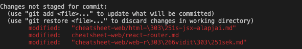
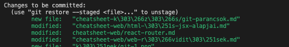
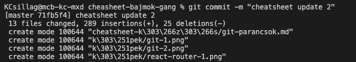
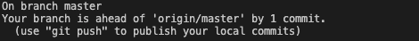
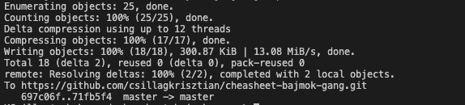
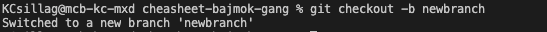
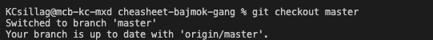
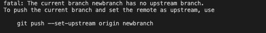

# Git Parancsok

A git egy fejlesztő legjobb barátja. Képes kódot tárolni, kombinálni és sokminden mást ami egy fejlesztőnek szüksége lehet.

---
## Git Telepítés

Ha szeretnénk a kódunkba git-et használni akkor szükségünk lesz a git-et a számítógépünkre feltelepíteni. Miután sikerült a telepítés, a következő paracs telepíti rá applikációnkra a git-et.
```
git init
```

---
## Git Clone

Ha le szeretnénk tölteni egy applikációt a gitről, akkor ezzel tudjuk átmásolni a gépünkre

```
git clone https://github.com/csillagkrisztian/learning-something.git
```
Javascript esetén klónozás után fel kell telepíteni azokat a kód könyvtárakat, melyeket felhasznált az applikáció készítője. Ezt a parancsot futtassuk az applikáció alap mappájában ahol a kód található. (React esetén ahol a src mappa található).

```
npm install
```

---

## Git kód feltöltése

Miután megváltoztatjuk a kódot valamilyen formában meg fog jelenni a VsCode esetében egy jel a git lapon.


### Git Status
A git status parancs lehetővé teszi, hogy leellenőrizzük a kódunk pillanatnyi állapotát. Ha megváltoztatunk valamit, pirossal fogja jelezni a megváltoztatott fájlokat.

```
git status
```


### Git Add . 
A git add . parancs hozzáadja a pillanatnyi mappában lévő megváltoztatott adatokat a lementeni kívánt adatok közé.

```
git add .
git status
```



### Git Commit -m
A git commit -m parancs segítségével el tudjuk határozni melyik változásokat szeretnénk elmenteni. Az -m segédparancs lehetőségével tudunk egy üzenetet is hozzácsatolni.

```
git commit -m "<komment>"
```


```
git status
```


Itt láthatjuk, hogy sikeressen el lett mentve a kód a saját gépünkre.

### Git Push

 Ha ezt az internetre szeretnénk feltölteni, hogy megváltoztatjuk a meglévő kódunkat ami GitHubon található: 

```
git push
```


Sikeresen megváltoztattunk a kódunkat az interneten.

---

## Git kód változások letöltése

### Git Fetch
A git fetch parancs frissíti a számítógépen lévő információt és szinkronizálja az interneten lévő git kóddal.

```
git fetch
```

### Git Pull 
Ha le szeretnénk változásokat tölteni, akkor:
```
git pull
```
---

## Git ág kialakítása

Sokszor ha ugyanazon az ágon dolgozik több fejlesztő fejfájást okozhatnak egymásnak külömböző kód konfliktusokkal. Ezeket "merge conflict"-eknek hívjuk és akkor történik ha két fejlesztő ugyanazt a kódot próbálja másképp megírni. Ilyenkor nem tudja a git eldönteni melyik kód a fontosabb a másiknál.

### Git Checkout -b

Elsősorban meg kell alakítanunk egy új ágat, avagy "branch"-et, hogy tudjuk külön dolgozni ugyanazzal az aplikációval.

```
git checkout -b "<ág elnevezése>"
```


Sikeresen meg is alakítottuk az új águnkat.

### Git Checkout

Ha vissza szeretnénk térni a fő ágra, vagy bármelyik másik létező ágra, akkor:

```
git checkout <ág neve>
```



### Esetleges Error

Ha erre az ágra el szeretnénk menteni adatot, ezt ugyanúgy a fenti "Git kód feltöltése" segítségével tehetjük, viszont egy problémába ütközhetünk a "git push" parancs során



Ez csak annyit jelent, hogy ez az ág még nem létezik az interneten csakis a saját számítógépünkön, ezért meg kell alakítani, hogy tudjunk rá push-olni.

```
git push origin <ág neve>
```

Ha esetleg nem tudunk egy ágat elérni, nem árt észben tarnatni a git fetch parancsot. Lehet, hogy csupán a számítógépünk nem töltötte le az ágat az internetről.
```
git fetch
```
---