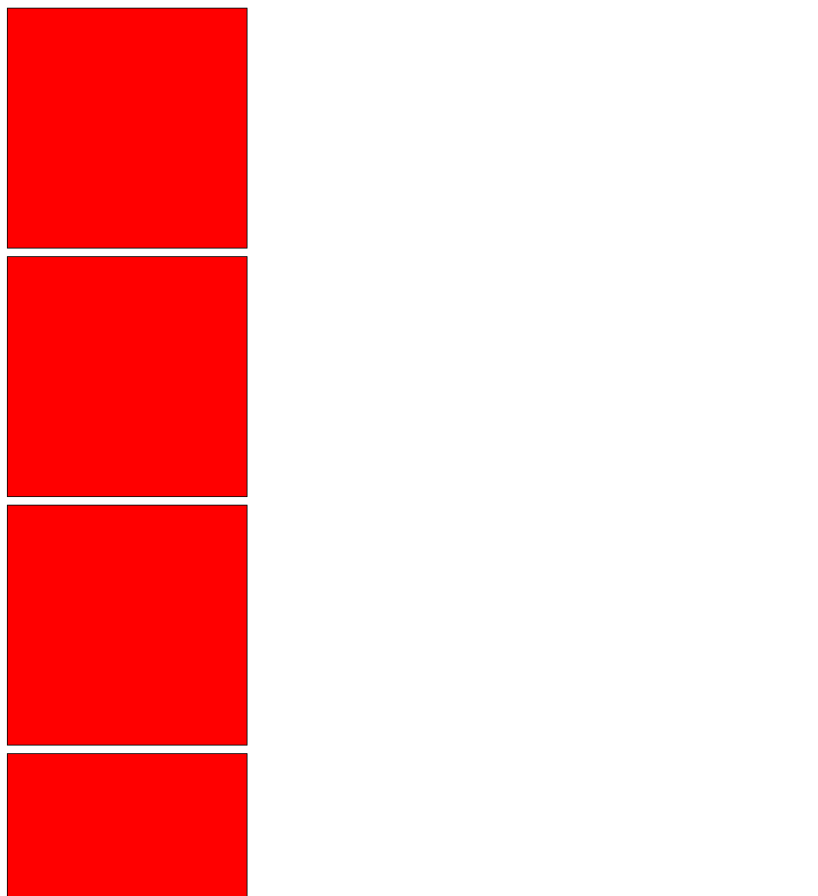
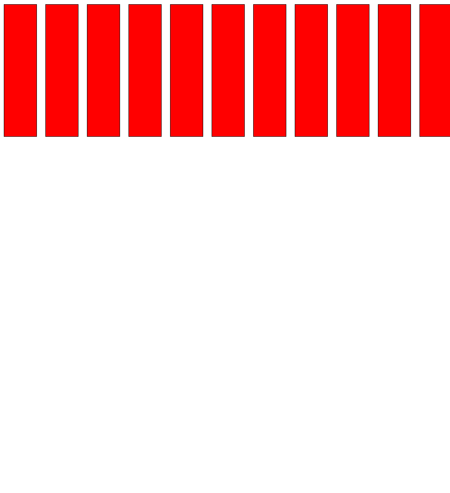
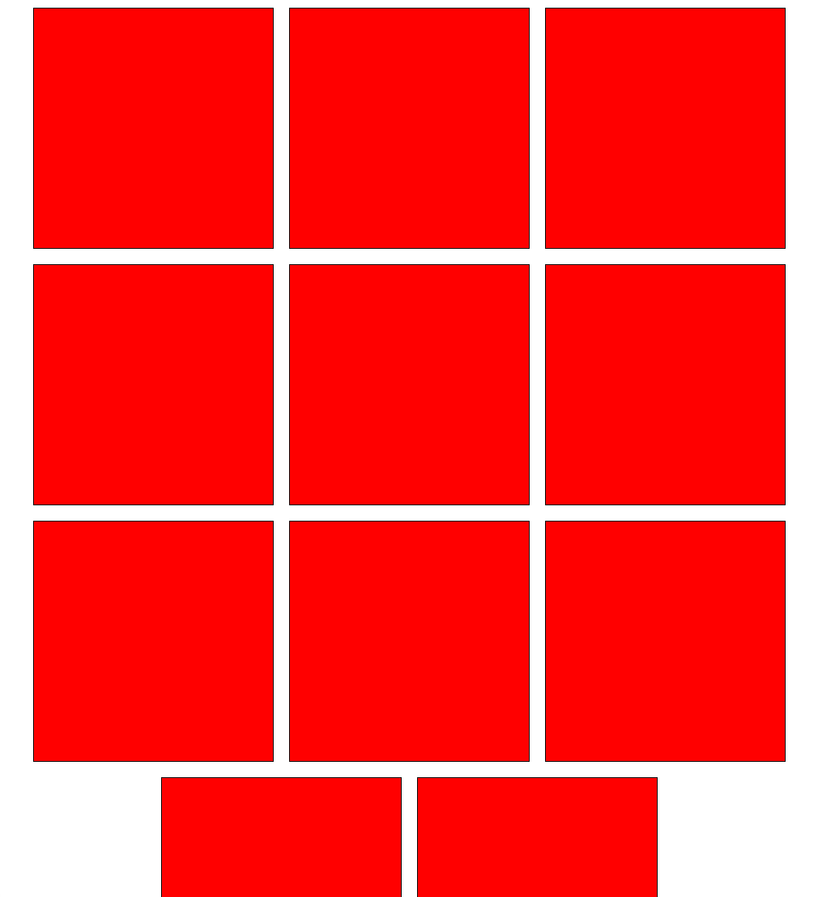

# CSS-Alapok
## Flexbox
A flexbox lehetővé teszi hogy bizonyos elemek egy ```div``` konténerben a látható oldal méretétől függően el legyenek rendezve.
https://css-tricks.com/snippets/css/a-guide-to-flexbox/

A megadott ```link``` tartalmazza az összes lehetséges módszert ahogyan ezt lehet használni. Legsűrűbben mi inkább egy féle módot alkalmazunk:

```
const Box = () => {
  return <div style={{
    height:'312px',
    width:'312px',
    backgroundColor:"red",
    border: 'black solid 1px',
    margin: '10px'
  }}></div>
}

function Example() 
  return (
    <div>
      <Box/>
      <Box/>
      <Box/>
      <Box/>
      <Box/>
      <Box/>
      <Box/>
      <Box/>
      <Box/>
      <Box/>
      <Box/>
    </div>
  );
}
```
Ebben a helyzetben készítettünk egy ```piros doboz```-t, ami szeretném, hogy az üres helytől függően helyezkedjen el jobb irányban és nem lefelé.

Példa:


Ehhez szükséges használnuk a ```flexbox```-ot.
A ```flexbox```-nak két elemhez van szüksége, egy ```szülő``` és egy ```gyermek``` elem.
A ```szülő(container)``` mely gyermekeket tartalmaz és a határ mely megszabja melyik elemek fognak rendeződni.
A ```gyermek(item)``` egy elem, melyből végtelen szám lehet és a szülő rendezi a pozícióját.

Először megdefiniáljuk a szülőt ezzel a ```css``` kulcssal:

```
function Example() 
  return (
    <div style={{
        display:'flex'
    }}>
      <Box/>
      <Box/>
      [...]
```
Példa:


Láthatjuk, hogy el is vannak rendezve, viszon össze vannak zsúfolva. Ebben az esetben, meg kell engednünk a ```szülő```-nek, hogy ahelyett, hogy torzítja a ```gyermek```-eket, legyenek új sorba téve.

```
function Example() 
  return (
    <div style={{
        display:'flex',
        flexWrap: "wrap"
    }}>
      <Box/>
      <Box/>
      [...]
```

Példa:


Na itt már haladunk, viszont az a baj, hogy nem természetes az elrendezés, túl sok üres hely van az oldalunk jobb szélén. Ezt is megoldhatjuk:

```
function Example() 
  return (
    <div style={{
        display:'flex',
        flexWrap: "wrap",
        justifyContent:"center"
    }}>
      <Box/>
      <Box/>
      [...]
```

Példa:


Na ezt már használhatjuk boltok felépítésére. További lehetőségek vagy különös felépítés szüksége esetén, használhatjuk ezt az oldalat: https://css-tricks.com/snippets/css/a-guide-to-flexbox/ mely mindent megmagyaráz részletessen és képek segítségével. (A bal oldali képek a ```szülő```-k, a jobb oldali képek a ```gyermek```-ek argumentumai)
