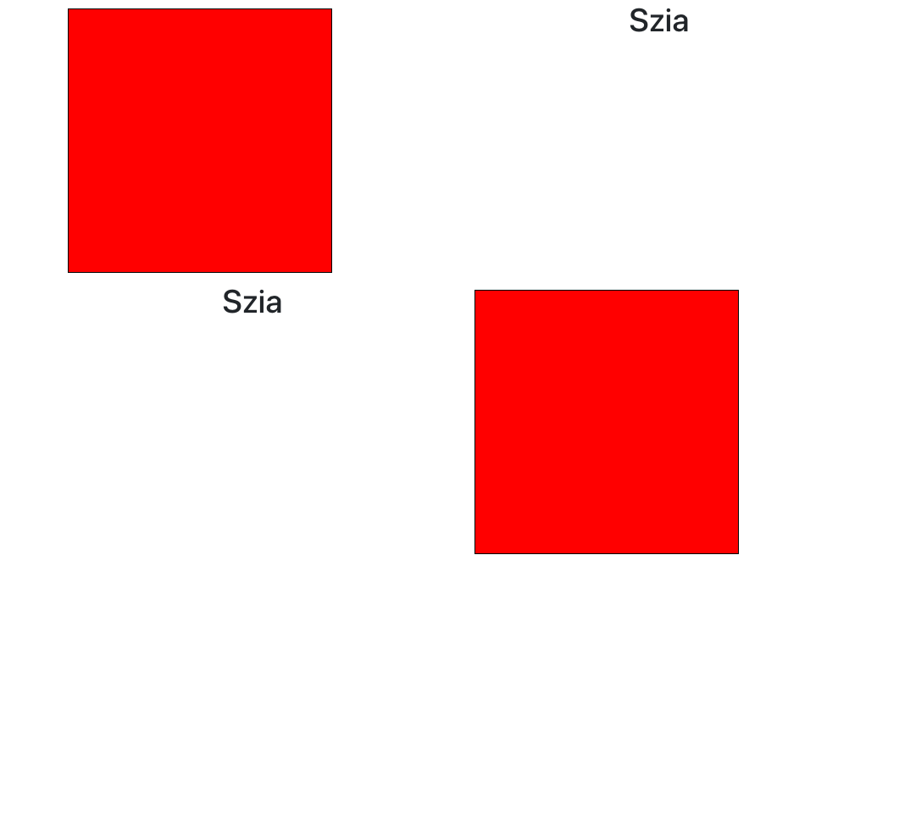
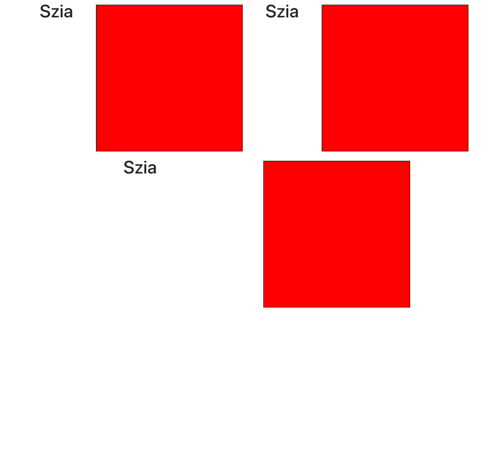

# React Bootstrap Alapok
A ```React Bootstrap Library``` egy séma könyvtár, mely kész ```css```-el rendelkező vizuális komponenseket ajánl a felhasználóknak. 

Még van ilyen pl: ```Material UI``` (https://mui.com/)

## Telepítés
A telepítés részleteit itt megtalálhatjuk: https://react-bootstrap.github.io/getting-started/introduction

## Container, Row és Col struktúra
Ez a ```flexbox``` segítségével felépített egyszerű ```lap elosztás struktúra```, mely lehetővé teszi, hogy oldalunkat több részre osztjuk. Részletek avagy kíváncsiság esetén: https://react-bootstrap.github.io/layout/grid/

Példa:
```
<Container>
  <Row>
    <Col>
      <Box></Box>
    </Col>
    <Col>
      <h1 style={{ textAlign: "center" }}>Szia</h1>
    </Col>
  </Row>
</Container>
```

- A ```Container``` egy ```szülő``` amely ebben az esetben az egész weboldalat jelképezi, de több ```Container```-t is tartalmazhat uzanaz a weboldal, pontosított méretekkel.
- A ```Row``` egy ```szülő``` és ```gyermek```, mely a sorokat jelképezi.
- A ```Col``` egy ```szülő``` és ```gyermek```, mely az oszlopokat jelképezi.

Tehát ha van több ```Row``` komponens, akkor több sorunk lesz.

Példa:
```
<Container>
  <Row>
    <Col>
      <Box></Box>
    </Col>
    <Col>
      <h1 style={{ textAlign: "center" }}>Szia</h1>
    </Col>
  </Row>
  <Row>
    <Col>
      <h1 style={{ textAlign: "center" }}>Szia</h1>
    </Col>
    <Col>
      <Box></Box>
    </Col>
  </Row>
</Container>
```



Bármennyi ```Col``` avagy oszlopunk is lehet, ami által annyi oszlop és sor részre oszthatjuk a weboldalunkat ahányra csak szeretnénk. 

Példa:
```
<Container>
  <Row>
    <Col>
      <h1 style={{ textAlign: "center" }}>Szia</h1>
    </Col>
    <Col>
      <Box></Box>
    </Col>
    <Col>
      <h1 style={{ textAlign: "center" }}>Szia</h1>
    </Col>
    <Col>
      <Box></Box>
    </Col>
  </Row>
  <Row>
    <Col>
      <h1 style={{ textAlign: "center" }}>Szia</h1>
    </Col>
    <Col>
      <Box></Box>
    </Col>
  </Row>
</Container>
```


Részletek esetén, vagy ha valami fintásabbat akarunk összehozni: https://react-bootstrap.github.io/layout/grid/ 
