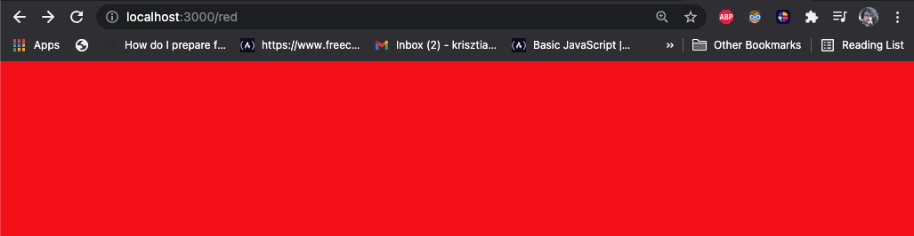
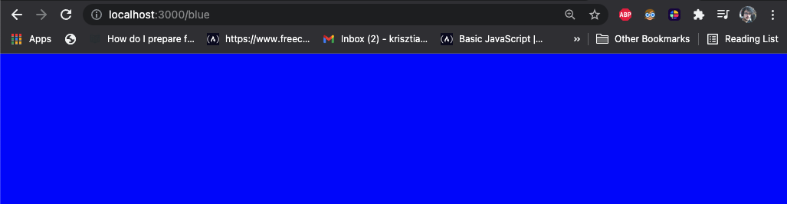
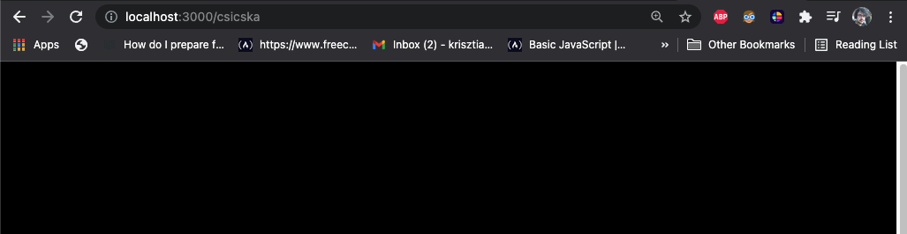
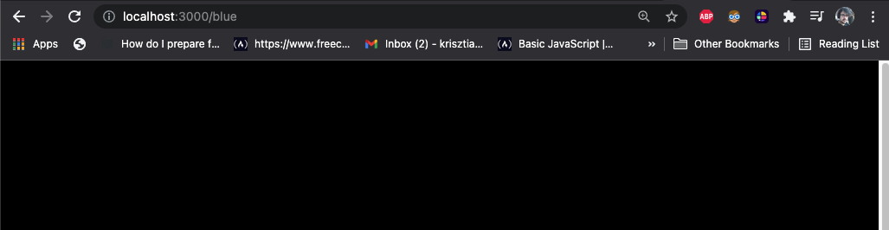
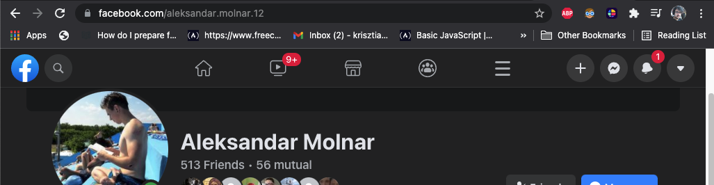
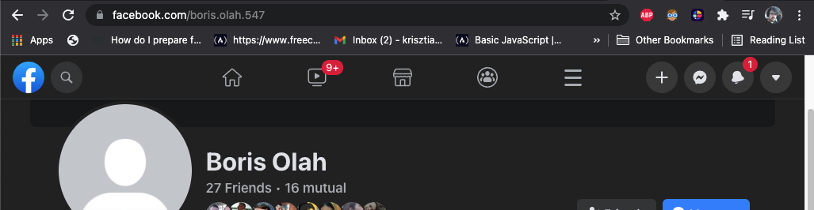

# React Router

## ...avagy több oldal használata

### Link: https://reactrouter.com/web/guides/quick-start

---

## Telepités

```
npm install react-router-dom
```

---
## Importálás

```
import {
  BrowserRouter as Router,
  Switch,
  Route,
  Link,
  useParams
} from "react-router-dom";
```

---

## Router

A ```Router``` komponensnek az a szerepe, hogy lehetővé tegye az oldalak váltogatását a ```React```-ban. Mindig legyen benne az egész ```App.js```-nek a ```JSX```-je.

```
function App() {
    [...]
return (
    <Router>
      <div>
        [...]
      </div>
    </Router>
}
```

---

## Switch

A ```Switch``` komponens teszi lehetővé, hogy tudjunk komponenseket válogatni egy bizonyos térben.
Úgy működik, hogy egyenként végig fut a ```Route``` komponenseken és összehasonlítja a böngészőbe található ```link```-kel.

Példa: A ```link``` a böngészőben itt található
> 

```
<Router>
  <Switch>
    <Route path="/red">
      <Red/>
    </Route>
    <Route path="/blue">
      <Blue/>
    </Route>
    <Route path="/">
      <Home />
    </Route>
  </Switch>
</Router>
```

Mivel a ```link``` megegyezik egy ```Route``` componens ```path``` argumentumával, ezért a ```Red``` komponenst fogja kimutatni.

```
 <Router>
      <Switch>
      -----------------------------
        <Route path="/red">
          <Red/>
        </Route>
      -----------------------------
        <Route path="/blue">
          <Blue/>
        </Route>
        <Route path="/">
          <Home />
        </Route>
      </Switch>
    </Router>
```
Ha a ```link```-et megváltoztatjuk a böngészőben, újra fentről lefelé megkeresi az azonosat.

Példa: Kicserléjük, blue-ra a linket a billentyűzetünkkel.
> 

```
 <Router>
      <Switch>
        <Route path="/red">
          <Red/>
        </Route>
      -----------------------------
        <Route path="/blue">
          <Blue/>
        </Route>
      -----------------------------
        <Route path="/">
          <Home />
        </Route>
      </Switch>
    </Router>
```

Abban az esetben ha a ```link``` nem egyezik meg egyik úttal sem, az alap útra tér rá.

Példa: 




```
 <Router>
      <Switch>
        <Route path="/red">
          <Red/>
        </Route>
        <Route path="/blue">
          <Blue/>
        </Route>
      -----------------------------
        <Route path="/">
          <Home />
        </Route>
      -----------------------------
      </Switch>
    </Router>
```

---
## A Switch további tudnivalói

A ```Switch``` nem kötelező, hogy az egész oldalat elfoglalja, tehát fent hagyhatunk vagy lent valamit minden oldalon.

Példa: A facebook fenti sora, sosem változik.

> 

```
function Facebook() {
    [...]
return (
    <Router>
        <Navigation/>
        <Switch>
          [...]
        </Switch>
    </Router>
}
```

A ```Switch``` sorrendje mindig a hosszabbtól rövidebb ```link``` felé kötelező, hogy haladjon, mert sorban keresi az azonosságokat.

Példa: A ```Home``` a többi ```Route``` előtt.



```
<Router>
  <Switch>
  ----------------------
    <Route path="/">
      <Home />
    </Route>
  ----------------------
    <Route path="/red">
      <Red/>
    </Route>
    <Route path="/blue">
      <Blue/>
    </Route>
  </Switch>
</Router>
```

Mivel az ```alaplink``` mindig megtalálható a ```link```-ben, bármennyi adalékot hozzáadunk, ezért mindig az elsőt fogja kimutatni.


---
## Route

A ```Route``` komponens jelképezi az egyik lapot amit elérhetünk.
<br>
<br>
Fontos argumentumok:

- ```path``` - ```"/"``` - string - a link amellyel a felhasználó a bizonyos oldalat eléri
- ```gyermekek``` -``` < Home /> ``` - komponens amelyet az oldal mutatni fog

```
function App() {
    [...]
return (
    <Router>
        <Switch>
          <Route path="/fehalsználók">
            <Users/>
          </Route>
          <Route path="/sajátprofil">
            <MyProfile/>
          </Route>
          <Route path="/">
            <Home/>
          </Route>
        </Switch>
    </Router>
}
```

---

## Link

A ```Link``` komponens egy ```link```-et készit amellyel a weboldalon belül tudunk másik oldalakra ugrándozni.
Megváltoztatja a böngésző ```link```-jét dinamikussan.
<br>
<br>
Fontos argumentumok:

- ```to``` - ```/``` - string - a ```link``` ahova szeretnénk menni

Példa: Egy lista ahol a ```link```-ek találhatók.

<div>
    <nav>
      <ul>
        <li>
          <a to="/">Home</a>
        </li>
        <li>
          <a to="/about">About</a>
        </li>
        <li>
          <a to="/users">Users</a>
        </li>
      </ul>
    </nav>
</div>

```
<div>
    <nav>
      <ul>
        <li>
          <Link to="/">Home</Link>
        </li>
        <li>
          <Link to="/about">About</Link>
        </li>
        <li>
          <Link to="/users">Users</Link>
        </li>
      </ul>
    </nav>
</div>
```

---

## Paraméterek - useParams

Ha ugyanazt a komponenst szeretnénk többször felhasználni, akkor szükségünk lesz egy ```paraméter```-re.

```
<Switch>
  <Route path="/fehalsználók/:id">
    <User/>
  </Route>
  <Route path="/fehalsználók">
    <Users/>
  </Route>
  <Route path="/">
    <Home/>
  </Route>
</Switch>
```

Példa erre, a facebook profil oldala:




Mind a két oldal esetén ugyan az a komponens van felhasználva, csak az utolsó eleme a link-nek változik dinamikusan.

Ebben az esetben használhatjuk a ```useParams``` ```hook```-ot: 

```
const User = () => {
  const params = useParams();
  return (...)
}⇡ useParams értéke

return (<Switch>
  <Route path="/fehalsználók/:id">
    <User/>
  </Route>
  <Route path="/fehalsználók">
    <Users/>
  </Route>
  <Route path="/">
    <Home/>
  </Route>
</Switch>)
```

A ```useParams``` ```hook``` összehasonlítja a ```Route```-nak a ```path```-jében megadott paramétert (ebben az esetben ```:id```), a böngészőben található ```link-```et, ami az első az esetben ```/aleksandar.molnar.12``` és összerakja ezeket egy objektumba: 
               


```
                        ⇡ useParams értéke a linkben 
const User = () => {
  const params = useParams();
  console.log(params);
  // params = {id:"aleksandar.molnar.12"}
  return (...)
}

return (<Switch>              ⇣ useParams kulcsa
  <Route path="/fehalsználók/:id">
    <User/>
  </Route>
  [...]
</Switch>
  
```

Ez az adat alapján egy jól összerakott adatbáziban már könnyen kitaláljuk kinek az adatára van szükségünk, hogy kitöltsük a weboldalat.


```
const User = () => {
  const params = useParams();
  console.log(params);
  // params = {id:"aleksandar.molnar.12"}

  const user = database.find(data => data.id === params.id);
  return (...)
}
```

---